# RAG — Retrieval-Augmented Generation
> A visual guide for students and junior developers

---

## 1. How It Works — The 3-Stage Pipeline

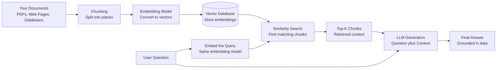

> 💡 Think of it like a library search — you ask a question, the librarian finds the best pages, then summarizes them for you.

---

## 2. Why RAG Matters — Problems It Solves

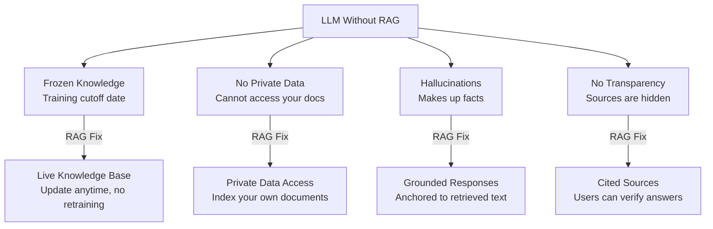

> Hallucination is when an AI confidently says something false. RAG reduces this by giving the model real text to reference instead of relying on memory.

---

## 3. Key Components of a RAG Pipeline

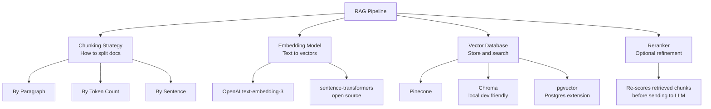

> Start with Chroma for local development — it runs in memory with zero setup. Move to Pinecone or pgvector when you go to production.

---

## 4. RAG vs Fine-Tuning — When to Use Which

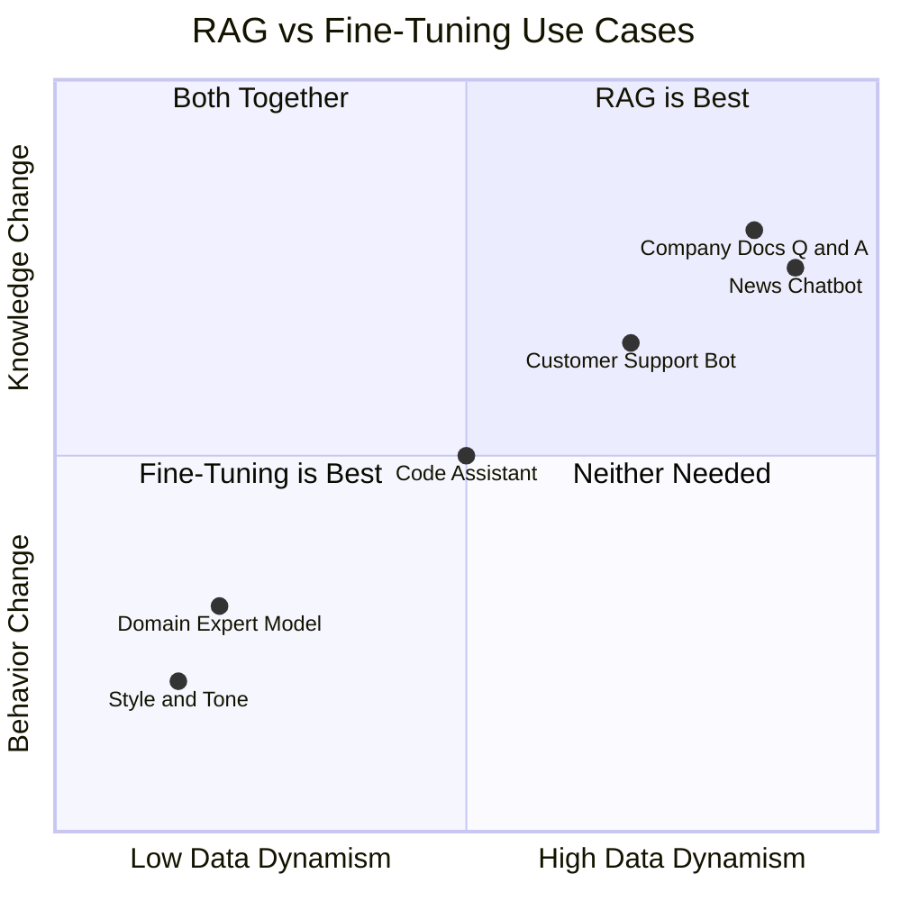

> 💡 Rule of thumb: use Fine-Tuning to change how the model behaves or talks. Use RAG to change what the model knows. Combine both for the best results.

---

## 5. Common Challenges in RAG Systems

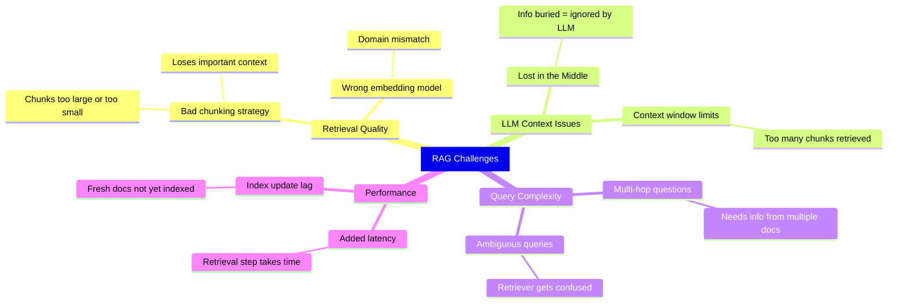

> 💡 "Lost in the Middle" is a real research finding — LLMs pay more attention to the beginning and end of their context. Put your most important chunks first!

---

## 6. Advanced RAG Variants — The Evolution

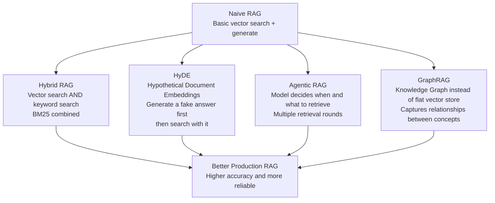

> Start with Naive RAG to learn the fundamentals, then adopt Hybrid RAG for most production apps. Agentic RAG is powerful but complex — save it for later.

# 7. RAG vs Prompt Engineering Comparison

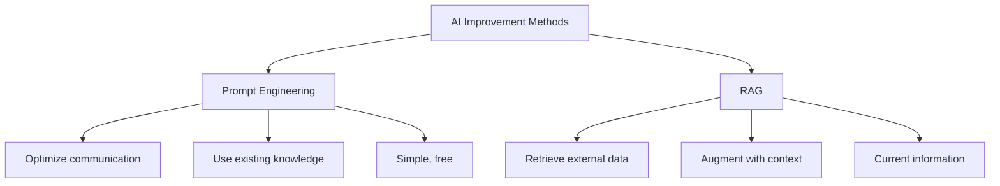

## Quick Comparison

**Prompt Engineering**: Better communication with the model's existing knowledge

**RAG**: Access to external information sources for specialized or current data

### Details

# 

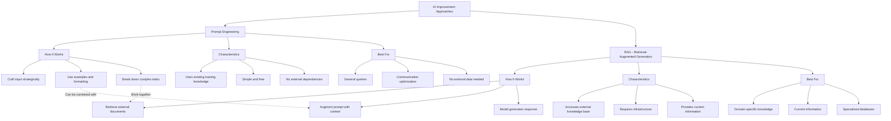

## Summary

**Prompt Engineering** optimizes how you communicate with an AI model to get better results from its existing training data.

**RAG** augments the model with external information sources, enabling it to provide answers based on current or specialized knowledge.

Both approaches are complementary and can be used together for optimal results.

# 8. RAG vs Agents
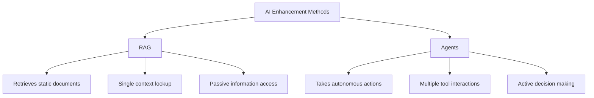

## Quick Comparison

**RAG**: Retrieves relevant documents from a knowledge base and feeds them into the prompt. Good for answering questions with external data.

**Agents**: Can use multiple tools autonomously, make decisions, and take actions based on results. The AI decides what to do, when to do it, and which tools to use.

## Key Differences

- **RAG is passive** - it retrieves information when asked
- **Agents are active** - they decide what actions to take and in what sequence
- **RAG is simpler** - straightforward retrieval and augmentation
- **Agents are more complex** - require planning, tool management, and error handling

# 9. How Agents Work

## 
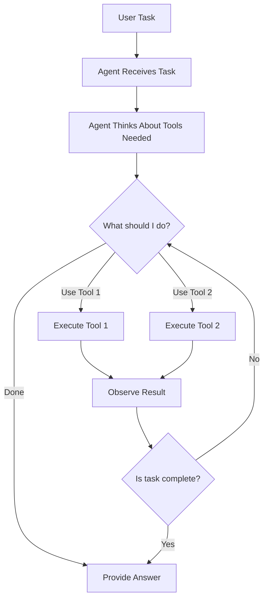

## Agent vs RAG vs Prompt Engineering
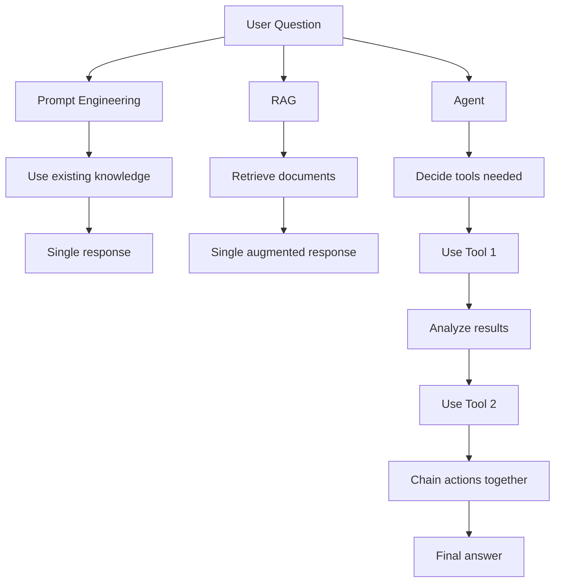

## Agent Components
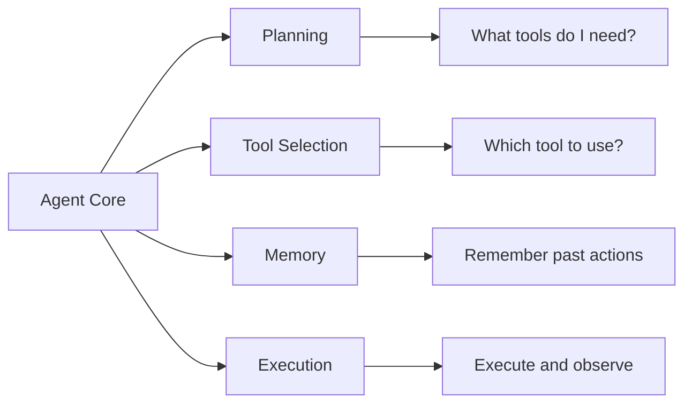

## Agent Loop - Detailed Example
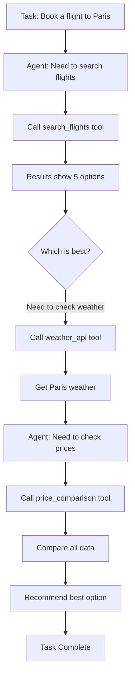

## Tools Available to Agents
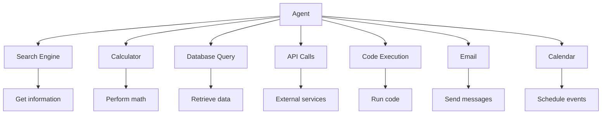
